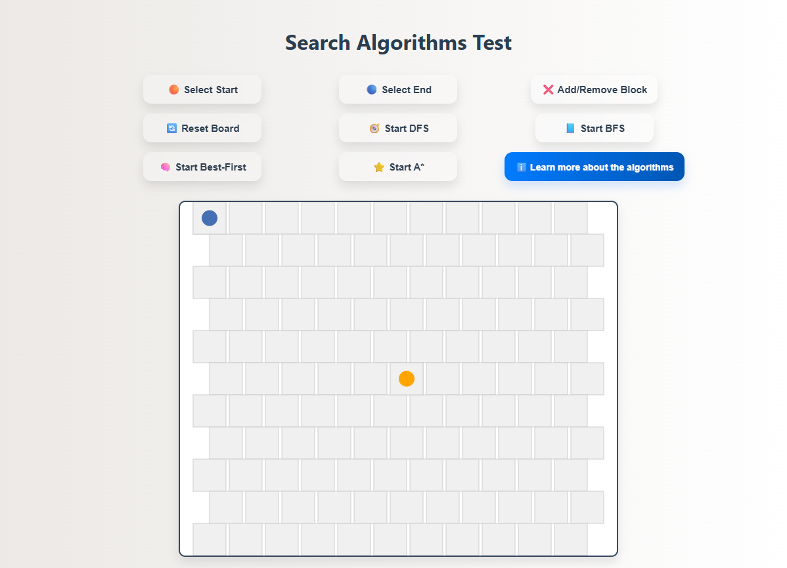

# Search Algorithms Visualizer

[Live Demo on GitHub Pages 🌐](https://alfredofilho.github.io/Blind-and-Heuristic-Search-Viewer/)

This project provides a visual simulation of various search algorithms, including Breadth-First Search (BFS), Depth-First Search (DFS), Best-First Search, and A* Search. Users can interactively set start and end points, add obstacles, and observe how each algorithm finds a path on a grid.

## Features

* **Interactive Grid:** Click to set start, end, and blocked nodes.
* **Multiple Algorithms:** Visualize the execution of:
    * Breadth-First Search (BFS)
    * Depth-First Search (DFS)
    * Best-First Search
    * A\* Search
* **Real-time Visualization:** Watch as algorithms explore nodes and discover paths.
* **Path Reconstruction:** Once a path is found, it's highlighted on the grid.
* **Simulation Information:** Displays current mode, start/end nodes, blocked nodes, and visited node count.

## Project Screenshot



## How to Run

To run this project locally, you **need to use a local web server**. Opening the `index.html` file directly in your browser (by double-clicking) will result in CORS (Cross-Origin Resource Sharing) security errors due to how JavaScript modules are imported in modern browsers.

### Using Python (Recommended)

If you have Python installed, the simplest way is to use its built-in HTTP server module:

1.  **Navigate to the project directory:** Open your terminal or command prompt and navigate to the folder where `index.html` is located (the root directory of your project).
    ```bash
    cd /path/to/your/project/Blind-and-Heuristic-Search-Viewer
    ```
2.  **Start the server:** Execute the following command:
    ```bash
    python -m http.server
    ```
    Or, for Python 2.x:
    ```bash
    python -m SimpleHTTPServer
    ```
3.  **Access in your browser:** Open your browser and go to `http://localhost:8000` (or the port indicated in your terminal, if different).

### Other Local Web Server Options (Alternatives)

You can also use other tools to create a local web server, such as:

* **Node.js:** If you have Node.js installed, you can install `http-server` globally:
    ```bash
    npm install -g http-server
    ```
    Then, in your project directory, run:
    ```bash
    http-server
    ```
* **VS Code Extensions:** If you use VS Code, the "Live Server" extension can be very helpful. Simply install it, right-click on `index.html`, and select "Open with Live Server".

## Usage

1.  **Select Start:** Click the "🟠 Select Start" button and then click on a cell on the canvas to set the starting point.
2.  **Select End:** Click the "🔵 Select End" button and then click on a cell on the canvas to set the ending point.
3.  **Add/Remove Block:** Click the "❌ Add/Remove Block" button and then click on cells to create or remove obstacles.
4.  **Run Algorithms:** Click on the buttons for "🧭 Start DFS", "📘 Start BFS", "🧠 Start Best-First", or "⭐ Start A\*" to see the respective algorithm in action.
5.  **Reset Board:** Click the "🔄 Reset Board" button to clear the grid and start over.
